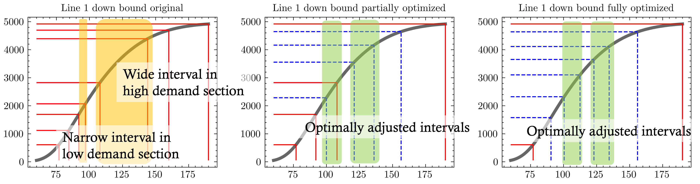

# Optimizing-Extended-Metro-Timetables

This repository is Implementation of Paper: "Optimizing Extended Metro Timetables During Year-End Events Using Graph Neural Networks: A Study on Passenger Flow Prediction and Timetable Optimization".

## Requirements and Dependencies

* **OS**: Ubuntu 22.04.3 LTS
* **Python**: python 3.10.12
* **CUDA**: 12.2 & **cuDNN**: 8.9

Download repository:

```
$ git clone https://github.com/KYRLAB/Optimizing-Extended-Metro-Timetables.git
```

Install python dependencies:

```
$ pip install --upgrade pip
$ pip install -r requirements.txt
```

## Datasets

We collect three kinds of data: metro ridership counts for Seoul and Busan, weekday train schedules from 00:00 to 02:00, and extended metro timetables.

### Download datasets

- The Seoul metro ridership data provided by the [Seoul Open Data Plaza](https://data.seoul.go.kr/dataList/OA-12921/F/1/datasetView.do).
- The Busan metro ridership data provided by the [Open Government Data portal](https://www.data.go.kr/data/3057229/fileData.do). 

### Folder structure

```
├── Optimizing-Extended-Metro-Timetables
│   ├── dataset
│   │   ├── seoul_line_1.csv
│   │   ├── busan_line_1.csv
│   │   ├── *.csv (Another dataset following the same schema)
│   ├── result
│   ├── assets
│   ├── src
├── *.py
├── README.md
├── requirements.txt
├── LICENSE
└── .gitignore
```

## Training and Inference

The training procedure and the inference procedure are included in `main.py`. To train and infer on a dataset by applying different hyperparameters, run the following commands:

```
usage: main.py [-h] [--dataset DATASET] [--station_index STATION_INDEX]
               [--window_size WINDOW_SIZE] [--horizon HORIZON]
               [--valid_ratio VALID_RATIO] [--epoch EPOCH] [--lr LR]
               [--multi_layer MULTI_LAYER] [--device DEVICE]
               [--validate_freq VALIDATE_FREQ] [--batch_size BATCH_SIZE]
               [--norm_method NORM_METHOD] [--optimizer OPTIMIZER]
               [--early_stop EARLY_STOP] [--early_stop_step EARLY_STOP_STEP]
               [--exponential_decay_step EXPONENTIAL_DECAY_STEP]
               [--decay_rate DECAY_RATE] [--dropout_rate DROPOUT_RATE]
               [--leakyrelu_rate LEAKYRELU_RATE]
```

The detailed descriptions about the hyperparameters are as following:

| Parameter name         | Description of parameter                          |
| ---------------------- | ------------------------------------------------- |
| dataset                | file name of input csv                            |
| station_index          | index of station to specify                       |
| window_size            | length of sliding window                          |
| horizon                | predict horizon                                   |
| valid_ratio            | ratio of validation                               |
| epoch                  | size of epoch                                     |
| lr                     | learning rate                                     |
| multi_layer            | number of hidden layers for StemGNN               |
| device                 | device on which the code works (cpu or cuda)      |
| validate_freq          | frequency of check status                         |
| batch_size             | batch size for data loader                        |
| norm_method            | method for normalization ('z_score' or 'min_max') |
| early_stop             | enable early stop while training                  |
| early_stop_step        | step size of early stop                           |
| exponential_decay_step | step of reducing learning rate                    |
| decay_rate             | percentage of reduce learning rate                |
| dropout_rate           | percentage of drop out                            |
| leakyrelu_rate         | slope for Leaky ReLU activation                   |

## Result

Source of original paper results:

  Timetable of Line 1 Jongno-3ga station for down tracks under each scenario: original, partially optimized, and fully optimized. The blue dashed lines represent the optimized timetable, and the red lines represent the fixed timetable.



  Plot of all results from the Monte Carlo simulation for Seoul Metro lines 1–6 and 8, as well as Busan Metro lines 1 and 2. The first three columns represent the down-bound track: the first column shows the original timetable, the second shows the partially optimized timetable, and the third shows the fully optimized timetable. The last three columns represent the same timetables, but for the up-bound track.


## Citation

If you find the code and algorithm useful in your research or conference, please cite:

```
@inproceedings{Optimizing-Extended-Metro-Timetables,
    author    = {Jinwoo Hyun, Hyungjun Joe, Cheyoung Lee, Young Rock Kim, and Youngho Min}, 
    title     = {Optimizing Extended Metro Timetables During Year-End Events Using Graph Neural Networks: A Study on Passenger Flow Prediction and Timetable Optimization}, 
    year      = {2024},
    publisher = {GitHub},
    journal   = {GitHub repository}
}
```

---

